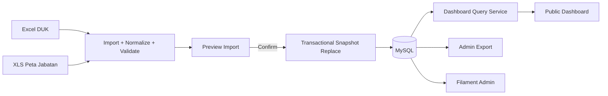

> **Dokumen desain awal.** Ketentuan periode/publikasi Peta Jabatan pada dokumen ini telah digantikan oleh [panduan publikasi mandiri](publikasi-duk-dan-peta-jabatan.md). Gunakan migrasi Laravel sebagai acuan skema terkini.

# Product Requirements Document (PRD)
## Dashboard Monitoring SDM BBPMP Provinsi Jawa Timur

**Versi dokumen:** 1.0
**Target data awal:** September 2026
**Stack target:** PHP 8.2.x, Laravel 12.x, Filament 3.3, MySQL 8.0.x
**Status:** Proposed / siap dijadikan acuan implementasi

---

## 1. Ringkasan Eksekutif

Aplikasi akan menggantikan dashboard monitoring SDM yang saat ini ditampilkan melalui Looker Studio/Data Studio dengan aplikasi Laravel yang mempunyai dua permukaan terpisah tetapi tetap berada dalam **satu codebase dan satu database**:

1. **Public Dashboard** — dapat dibuka tanpa login, hanya menampilkan data agregat/rekap visualisasi.
2. **Filament Admin Panel** — berada di `/admin`, wajib login, digunakan untuk import data bulanan, preview/validasi, publish periode, export, user/role/permission, dan audit import.

### Keputusan arsitektur utama

**Gunakan satu Filament panel saja, yaitu Admin Panel. Jangan membuat public dashboard sebagai panel Filament kedua pada MVP.**

Public dashboard dibuat sebagai halaman Laravel biasa (Blade + Livewire/Alpine + library chart seperti ApexCharts/Chart.js). Alasan:

- boundary keamanan lebih jelas antara fitur publik dan administrasi;
- route/resource Filament tidak perlu diekspos ke pengguna anonim;
- tampilan publik dapat dibuat lebih ringan, responsif, dan bebas dari pola UI admin;
- business logic tetap dapat dipakai bersama melalui Service/Query layer;
- lebih mudah menghindari kebocoran data person-level seperti NIP dan nama.

Struktur URL yang direkomendasikan:

- `/` atau `/dashboard` → public dashboard;
- `/admin` → Filament Admin Panel;
- tidak ada resource data pegawai yang dapat diakses tanpa autentikasi.

---

## 2. Temuan dari File September 2026

### 2.1 File DUK

File `9. DUK BBPMP PROVINSI JAWA TIMUR_SEPTEMBER 2026.xlsx` berisi sheet:

- `DUK PEGAWAI`
- `NEW`
- `(2)`
- `P3K - PPNPN`
- `RUANG`

Untuk populasi pegawai aktif, **`DUK PEGAWAI` direkomendasikan sebagai source of truth utama**. Struktur utamanya memuat:

- Nama
- NIP/NIP3K
- Pangkat
- Golongan
- Jabatan
- Kelas Jabatan
- Penempatan/tim
- Pendidikan
- Jenis Kelamin
- Status

Pada pemeriksaan struktur file, `DUK PEGAWAI` memiliki 161 baris data. Status yang terbaca adalah:

- 110 PNS
- 49 PPPK
- 1 PPNPN
- 1 baris status kosong

Terdapat gap nomor sumber dari 160 ke 168. Ini menunjukkan bahwa sistem import harus memvalidasi kualitas data dan **tidak boleh menjadikan nomor urut Excel sebagai primary key**.

Sheet `P3K - PPNPN` berisi 51 baris dan mempunyai informasi tambahan seperti jabatan awal, jabatan P3K, tugas, status, pendidikan, dan jenis kelamin. Status yang terbaca di sheet ini mencakup PPPK, PPPK Paruh Waktu, dan PPNPN. Karena jumlahnya tidak identik dengan populasi utama, sheet ini **tidak boleh otomatis menambah populasi aktif**. Pada MVP sheet tersebut hanya dapat dipakai sebagai data enrichment untuk record yang sudah ada di `DUK PEGAWAI`, dengan unmatched record masuk ke laporan warning.

### 2.2 File Peta Jabatan/Kebutuhan

File `Peta_Jabatan_Kebutuhan_2026-09-28_024817.xls` memuat struktur data antara lain:

- Unit Organisasi Induk
- Satuan Kerja
- Nama Jabatan
- Jenis Jabatan
- Kelas Jabatan
- Usia Pensiun
- Jumlah Pemangku
- Jumlah Kebutuhan
- Jumlah Kosong
- Status
- Total Pensiun 5 Tahun
- Pensiun per tahun
- Proyeksi Kebutuhan per tahun

Header file menunjukkan rentang proyeksi pensiun 2026–2032 dan proyeksi kebutuhan 2026–2030. Tahun harus dibaca **dinamis dari header**, bukan di-hard-code, agar file tahun berikutnya tetap dapat diimport tanpa perubahan schema.

---

## 3. Masalah yang Diselesaikan

Saat ini rekap SDM bergantung pada file yang berubah setiap bulan dan dashboard terpisah. Pembaruan data berpotensi memerlukan penyesuaian manual, status pegawai dapat berubah, nama/atribut dapat berubah, dan tidak ada mekanisme terkontrol untuk mengganti snapshot bulanan.

Produk harus:

- menerima data bulanan dari dua sumber utama;
- mengganti snapshot periode yang sama secara otomatis saat file baru diimport;
- mempertahankan periode sebelumnya untuk histori;
- menghasilkan dashboard publik dari data yang telah dipublish;
- menyediakan export sesuai filter;
- mengurangi edit manual;
- menyediakan audit trail import;
- tidak membocorkan data person-level pada halaman publik.

---

## 4. Tujuan Produk

### Tujuan utama

1. Menyediakan dashboard monitoring SDM BBPMP Jawa Timur yang dapat diakses tanpa login.
2. Memisahkan data menjadi dua grup utama:
   - ASN
   - PPNPN
3. Mengelola perubahan data per bulan menggunakan konsep **monthly snapshot**.
4. Mengizinkan admin melakukan import ulang tanpa melakukan edit record satu per satu.
5. Menyediakan visualisasi yang konsisten dengan kebutuhan monitoring SDM.
6. Menyediakan export data berbasis periode dan filter.
7. Menyimpan histori periode serta histori import.

### Non-goals MVP

- payroll;
- presensi;
- SK digital;
- workflow kepegawaian lengkap;
- penilaian kinerja individu;
- portal profil pegawai publik;
- integrasi otomatis ke SIASN/BKN bila belum tersedia API resmi.

---

## 5. Pengguna

### Public Viewer

Pengguna tanpa login yang hanya membutuhkan rekap agregat SDM. Public Viewer tidak boleh melihat NIP atau data person-level.

### Admin SDM

Pengguna internal yang dapat:

- membuat/memilih periode;
- import file;
- melihat preview dan warning;
- publish data;
- melihat detail data;
- export;
- melihat histori import.

### Super Admin

Selain hak Admin SDM, dapat mengelola:

- users;
- roles;
- permissions;
- konfigurasi sistem;
- rollback/publish ulang periode.

### Internal Viewer — opsional

Role login read-only untuk pengguna internal yang membutuhkan tabel detail namun tidak boleh import/publish.

---

## 6. Information Architecture

### Public

`/dashboard`

Komponen:

- header instansi;
- indikator periode aktif;
- pemilih periode;
- tab/segment ASN dan PPNPN;
- bagian Peta Jabatan/Kebutuhan;
- kartu KPI;
- chart;
- informasi terakhir diperbarui.

### Admin

`/admin`

Navigasi yang direkomendasikan:

- Dashboard Admin
- Periode Data
- Import Data
- Data SDM
- Peta Jabatan & Kebutuhan
- Export Data
- Histori Import
- Users
- Roles & Permissions

Resource Data SDM dan Peta Jabatan pada MVP sebaiknya **read-only atau sangat dibatasi**, karena prinsip utama adalah koreksi dilakukan dari file sumber lalu re-import, bukan mengedit database secara manual.

---

## 7. Model Periode dan Publikasi

Setiap data terikat pada `reporting_period`, misalnya `2026-09-01`.

Satu periode dapat memiliki:

- import DUK SDM;
- import Peta Jabatan/Kebutuhan;
- status `draft`, `ready`, atau `published`.

### Alur bulanan

1. Admin membuat/memilih periode September 2026.
2. Admin import DUK.
3. Sistem parse, normalize, validate, dan membuat preview.
4. Admin import Peta Jabatan/Kebutuhan.
5. Sistem membuat preview dan summary.
6. Jika semua valid, periode menjadi `ready`.
7. Admin memilih **Publish**.
8. Public dashboard berpindah ke data periode tersebut secara atomik.

Dengan cara ini, pengunjung publik tidak pernah melihat kondisi "DUK sudah September tetapi Peta Jabatan masih Agustus".

---

## 8. Aturan Import

### 8.1 Prinsip utama: Full Snapshot Replace per Periode

Kebutuhan "nama yang sama otomatis ditimpa dan data lama dihapus" direalisasikan dengan **replace snapshot**, bukan sekadar update record per nama.

Saat mengimport ulang sumber yang sama untuk periode yang sama:

- record snapshot periode+sumber lama dihapus;
- semua record valid dari file baru dimasukkan;
- transaksi dilakukan atomik;
- jika proses gagal, data lama tetap utuh;
- periode bulan sebelumnya tidak ikut terhapus.

Contoh:

- September diimport ulang → snapshot September diganti.
- Oktober diimport → September tetap tersimpan sebagai histori.

Ini lebih aman daripada `upsert` per baris karena pegawai yang sudah tidak ada di file terbaru juga otomatis hilang dari snapshot periode tersebut.

### 8.2 Identitas pegawai

Urutan pencocokan yang direkomendasikan:

1. `NIP/NIP3K` valid → identifier utama.
2. Jika tidak memiliki NIP/NIP3K, gunakan `normalized_name`.
3. Nomor urut Excel tidak digunakan sebagai identifier.

`normalized_name` hanya digunakan sebagai fallback, karena nama dapat berubah format/titel.

### 8.3 Normalisasi

Import service harus:

- trim spasi depan/belakang;
- collapse multiple spaces;
- menyamakan variasi status;
- menyamakan variasi pendidikan seperti `DIV` dan `D IV`;
- menyimpan display value asli bila diperlukan;
- mengubah field numerik menjadi integer;
- tidak menganggap `-` sebagai NIP;
- menyimpan `raw_payload` untuk troubleshooting.

### 8.4 Validasi DUK

Minimal:

- Nama wajib.
- NIP wajib jika tersedia untuk ASN, tetapi PPNPN dapat null.
- Gender jika diisi harus masuk mapping yang dikenal.
- Kelas Jabatan harus integer atau null.
- Status harus masuk daftar mapping yang dikenal atau ditandai `UNKNOWN`.
- Duplicate NIP pada satu file harus menjadi error.
- Duplicate fallback name harus menjadi warning/error tergantung konteks.

Baris dengan status kosong tidak boleh diam-diam diasumsikan PNS/PPPK. Sistem harus menampilkan warning `Unclassified`.

### 8.5 Sheet utama

Importer tidak boleh mengambil "sheet pertama" secara buta.

Untuk file DUK:

- target utama: `DUK PEGAWAI`;
- `P3K - PPNPN`: optional enrichment;
- `NEW`, `(2)`, dan `RUANG`: diabaikan pada MVP kecuali kelak dibuat requirement khusus.

### 8.6 Peta Jabatan/Kebutuhan

Importer harus mencari header berdasarkan nama kolom, bukan posisi kolom tetap.

Kolom `Pensiun YYYY` dan `Proyeksi Kebutuhan YYYY` diparsing menggunakan pola tahun dan disimpan ke tabel child projection.

### 8.7 Import Preview

Sebelum commit, admin melihat:

- total baris terbaca;
- total valid;
- total error;
- total warning;
- record baru;
- record berubah;
- record tidak berubah;
- record yang akan hilang dari snapshot karena tidak ada di file baru;
- duplicate;
- unmatched enrichment.

Admin hanya dapat Publish/Commit jika error blocking = 0.

### 8.8 Idempotency

Sistem menyimpan SHA-256 file.

Jika file dengan checksum sama diimport ulang untuk periode dan source yang sama:

- sistem memberi notifikasi duplicate/no-op;
- admin tidak perlu membuat data ganda.

---

## 9. Definisi Grup Pegawai

### ASN

Mencakup status:

- PNS
- PPPK
- PPPK Paruh Waktu

### PPNPN

Mencakup:

- PPNPN

Jika terdapat status tidak dikenal:

- tampil sebagai `Belum terklasifikasi` di admin;
- tidak disembunyikan;
- public dashboard dapat menampilkan KPI data quality bila diperlukan, atau record tersebut dikeluarkan dari pembagian ASN/PPNPN sampai status diperbaiki pada sumber.

---

## 10. Public Dashboard

### 10.1 Global Controls

- Periode, default ke periode published terbaru.
- Segment `ASN` / `PPNPN`.
- Filter opsional:
  - gender;
  - pendidikan;
  - status;
  - golongan;
  - jabatan;
  - kelas jabatan;
  - penempatan.

Filter public tidak boleh menghasilkan endpoint yang mengembalikan record person-level.

### 10.2 Dashboard ASN

KPI utama:

- Total ASN
- PNS
- PPPK
- PPPK Paruh Waktu
- Data belum terklasifikasi

Visualisasi:

- Gender — donut/bar
- Status ASN — donut
- Kualifikasi Pendidikan — bar
- Golongan — bar
- Jabatan — horizontal bar Top N + "Lainnya"
- Kelas Jabatan — bar
- Penempatan/Tim Kerja — horizontal bar
- Perbandingan dengan periode sebelumnya — optional v1.1

### 10.3 Dashboard PPNPN

KPI:

- Total PPNPN
- distribusi gender;
- distribusi pendidikan;
- jabatan/jenis pekerjaan;
- penempatan.

Jika data hanya memiliki satu record, UI harus tetap masuk akal dan tidak memaksa banyak pie chart satu-slice. Gunakan KPI dan compact bar/table bila lebih informatif.

### 10.4 Peta Jabatan & Kebutuhan

KPI:

- jumlah jenis jabatan;
- total pemangku;
- total kebutuhan;
- total kekosongan;
- posisi `Kurang/Sesuai/Lebih` sesuai source.

Visual:

- kebutuhan vs pemangku per jabatan;
- kekosongan terbesar;
- status kebutuhan;
- proyeksi pensiun per tahun;
- proyeksi kebutuhan per tahun.

### 10.5 Last Updated

Public dashboard menampilkan:

- periode data;
- tanggal/jam publish terakhir.

Jangan tampilkan nama file internal atau nama admin ke publik kecuali memang dibutuhkan.

---

## 11. Export

Export berada di Filament Admin Panel.

### Filter

- Periode
- Grup: ASN / PPNPN / Semua
- Status
- Gender
- Pendidikan
- Golongan
- Jabatan
- Kelas Jabatan
- Penempatan

Untuk Peta Jabatan:

- Periode
- Jenis Jabatan
- Kelas Jabatan
- Status Kebutuhan

### Format

MVP:

- XLSX
- CSV

Opsional:

- PDF rekap, jika benar-benar dibutuhkan.

### Jenis export

1. Data SDM detail.
2. Peta Jabatan/Kebutuhan.
3. Rekap dashboard agregat — opsional.

Export detail berisi data person-level sehingga hanya tersedia setelah login.

---

## 12. Admin Dashboard

Admin dashboard tidak perlu menduplikasi seluruh public dashboard.

Widget admin lebih fokus pada operasional:

- periode published aktif;
- status import masing-masing source;
- jumlah error/warning;
- jumlah record SDM;
- jumlah record peta jabatan;
- import terakhir;
- tombol Import dan Publish.

Admin dapat memiliki tombol "Lihat Public Dashboard".

---

## 13. Role dan Permission

Permission minimum:

- `period.view`
- `period.create`
- `period.publish`
- `import.view`
- `import.create`
- `import.commit`
- `personnel.view`
- `position_requirement.view`
- `export.personnel`
- `export.position_requirement`
- `user.manage`
- `role.manage`

Suggested mapping:

- Super Admin → semua.
- Admin SDM → semua data/import/export/publish, tanpa role management.
- Internal Viewer → view + export terbatas.
- Public → tidak memakai role; hanya route aggregate publik.

---

## 14. Privasi dan Keamanan

Karena public dashboard tidak membutuhkan login:

- public hanya menerima data agregat;
- nama dan NIP tidak pernah dikirim ke browser publik;
- detail pegawai hanya berada di admin;
- file upload disimpan di private storage;
- validasi extension, MIME type, dan ukuran file;
- audit `uploaded_by`, waktu, checksum, source, period;
- CSRF dan auth Laravel untuk admin;
- route admin memakai permission;
- rate limit endpoint agregat jika dibuat sebagai JSON endpoint;
- log exception tidak boleh menulis full row sensitif ke log produksi.

---

## 15. Non-Functional Requirements

### Performance

Target awal:

- first dashboard render < 2 detik pada koneksi normal;
- filter chart < 1 detik untuk dataset skala ribuan record;
- import 10.000 row < 60 detik dengan chunk/batch processing.

### Reliability

- import dalam transaction;
- gagal import tidak merusak published snapshot;
- period publish atomik;
- backup database terjadwal;
- raw source file dapat disimpan sesuai retention policy.

### Maintainability

- Laravel migrations menjadi source of truth schema;
- jangan membuat/ubah table produksi manual melalui MySQL Workbench;
- import mapping dipisahkan dari Filament Page;
- chart query dipisahkan dalam service/query objects;
- enum/value mappings terpusat;
- automated tests untuk parser dan publish.

### Accessibility

- chart memiliki textual summary/legend;
- kontras warna memadai;
- tidak mengandalkan warna saja untuk status;
- keyboard-friendly untuk filter.

---

## 16. Rekomendasi Teknis

### Backend

- Laravel 12
- MySQL 8
- Laravel Excel / PhpSpreadsheet melalui `maatwebsite/excel` untuk `.xlsx` dan `.xls`
- Filament 3.3 untuk admin
- Spatie Permission / plugin Filament yang sudah tersedia untuk role-permission
- Laravel Cache

### Frontend Public

- Blade
- Livewire
- Tailwind
- ApexCharts atau Chart.js

Tidak perlu membuat SPA React/Vue untuk requirement saat ini.

### Struktur service yang disarankan

```text
app/
├── Domain/
│   ├── Personnel/
│   │   ├── PersonnelImportService.php
│   │   ├── PersonnelNormalizer.php
│   │   └── PersonnelDashboardQuery.php
│   ├── PositionRequirement/
│   │   ├── PositionRequirementImportService.php
│   │   └── PositionRequirementDashboardQuery.php
│   └── ReportingPeriod/
│       └── PublishPeriodService.php
├── Filament/
│   └── Admin/
└── Livewire/
    └── PublicDashboard/
```

---

## 17. Arsitektur Aliran Data



---

## 18. Acceptance Criteria

### Public Dashboard

- [ ] Dapat dibuka tanpa login.
- [ ] Default menunjukkan periode published terbaru.
- [ ] Dapat memilih periode lama.
- [ ] ASN dan PPNPN dapat dilihat terpisah.
- [ ] Tidak ada NIP atau nama pegawai pada payload publik.
- [ ] Chart sesuai filter.
- [ ] Peta Jabatan/Kebutuhan tampil dari source periode yang sama.

### Import

- [ ] Admin dapat upload `.xlsx` DUK.
- [ ] Admin dapat upload `.xls/.xlsx` Peta Jabatan.
- [ ] Sistem mendeteksi sheet/header yang benar.
- [ ] Sistem menampilkan preview.
- [ ] Duplicate NIP terdeteksi.
- [ ] Status kosong/tidak dikenal menghasilkan warning.
- [ ] Re-import periode yang sama mengganti snapshot periode tersebut.
- [ ] Record yang hilang dari file baru juga hilang dari snapshot periode itu.
- [ ] Periode sebelumnya tetap tersimpan.
- [ ] File duplicate terdeteksi dari checksum.
- [ ] Import gagal tidak menghapus data published sebelumnya.

### Export

- [ ] Admin dapat export XLSX/CSV.
- [ ] Export mengikuti filter.
- [ ] Export memiliki informasi periode.
- [ ] Public tidak memiliki akses ke export person-level.

### Security

- [ ] `/admin` wajib login.
- [ ] Permission diterapkan per aksi.
- [ ] Public tidak dapat mengakses Filament resource.
- [ ] File sumber berada di private storage.

---

## 19. Test Scenarios Penting

1. Import September untuk pertama kali.
2. Import file September yang sama dua kali → no duplicate.
3. Import September revisi dengan pegawai yang sama tetapi jabatan berubah → snapshot berubah.
4. Import September revisi dengan satu nama hilang → record itu hilang dari September.
5. Import Oktober → September tetap tersedia.
6. Duplicate NIP dalam satu file → blocking error.
7. Status kosong → warning/unclassified.
8. PPNPN tanpa NIP → fallback identity menggunakan normalized name.
9. Nama yang sama tetapi NIP berbeda → tidak boleh otomatis digabung.
10. File Peta Jabatan tahun berikutnya memiliki kolom `Pensiun 2033` → sistem dapat menyimpan tanpa migration baru.
11. Publish hanya satu source → ditolak bila konfigurasi mensyaratkan dua source lengkap.
12. Public request mencoba memperoleh detail nama/NIP → tidak tersedia.
13. Export ASN September → hanya row ASN September.
14. Admin tanpa permission publish → tombol/action tidak tersedia dan endpoint menolak.

---

## 20. Fase Implementasi

### Fase 1 — Foundation

- migrations;
- model & relationships;
- role/permission;
- reporting period;
- import batch/audit;
- DUK importer;
- Peta Jabatan importer;
- preview + transactional replace.

### Fase 2 — Public Dashboard

- public layout;
- period selector;
- ASN/PPNPN widgets;
- Peta Jabatan/Kebutuhan;
- responsive UI;
- cache query.

### Fase 3 — Export & Hardening

- XLSX/CSV export;
- audit/import history;
- test suite;
- security review;
- performance;
- backup/retention.

### Fase 4 — Optional Enhancement

- delta bulan-ke-bulan;
- trend multi-periode;
- notification import;
- internal read-only viewer;
- mapping alias nama jika ada mismatch historis yang berulang.

---

## 21. Keputusan Produk yang Direkomendasikan

1. **Satu Filament Admin Panel, bukan dua panel.**
2. Public dashboard dibuat di luar Filament tetapi tetap dalam Laravel yang sama.
3. `DUK PEGAWAI` menjadi populasi aktif utama.
4. Sheet supplemental tidak boleh menambah populasi aktif tanpa record canonical.
5. Import menggunakan **full-snapshot replace per source + periode**.
6. Histori bulan lama tidak dihapus.
7. NIP/NIP3K digunakan sebagai identifier utama; nama hanya fallback.
8. Peta Jabatan memakai projection child table dengan year dinamis.
9. Public hanya menampilkan data agregat.
10. MySQL schema dikelola melalui Laravel migration; MySQL Workbench hanya sebagai client/admin tool.

---

## 22. Assumptions

PRD ini memakai asumsi berikut:

- dashboard lama adalah referensi fungsi/visual, bukan struktur teknis yang harus dipertahankan;
- data publik cukup berupa agregat dan tidak membutuhkan daftar nama;
- dua file diupload oleh admin setiap bulan;
- koreksi data dilakukan pada file sumber dan kemudian re-import;
- PPNPN dan ASN dapat berubah status dari waktu ke waktu sehingga status harus disimpan per snapshot, bukan hanya di master person;
- dashboard harus dapat melihat periode historis.

Jika salah satu asumsi berubah, model data tetap dapat dikembangkan tanpa mengganti arsitektur dasar.
